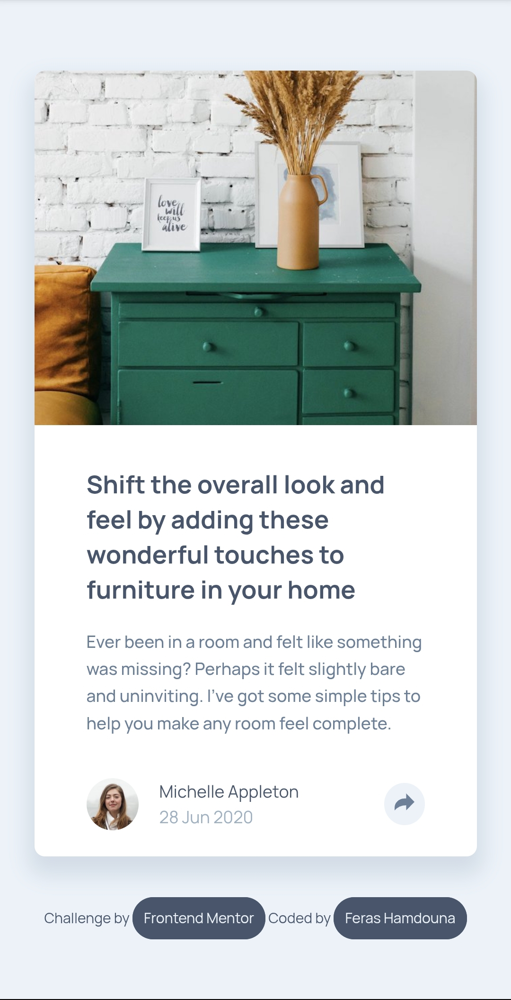
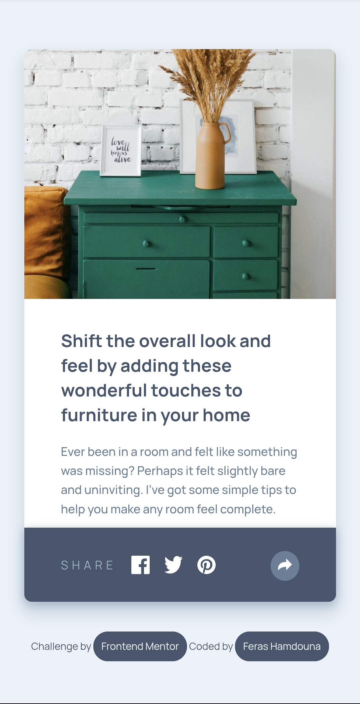
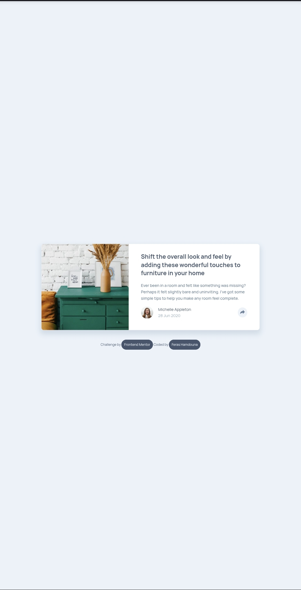
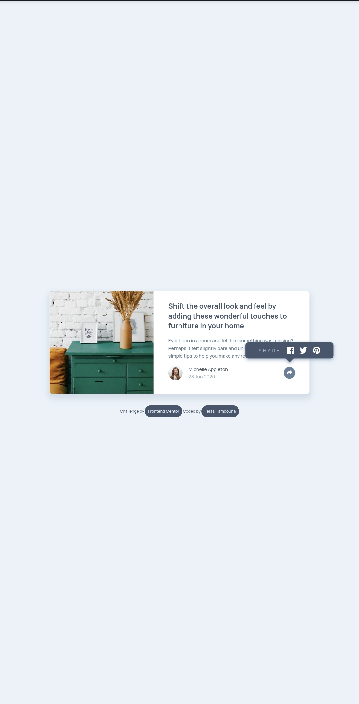

# Article Preview Component Solution

This is a solution to the [Article Preview Component challenge on Frontend Mentor](https://www.frontendmentor.io/challenges/article-preview-component-dYBN_pYFT).

## Table of contents

- [Overview](#overview)
  - [The challenge](#the-challenge)
  - [Screenshot](#screenshot)
  - [Links](#links)
- [My process](#my-process)
  - [Built with](#built-with)
- [Author](#author)

## Overview

### The challenge

Users should be able to:

- View the optimal layout depending on their device's screen size.
- See hover states for interactive elements.
- Share the article via social media links by clicking the share icon.

### Screenshot

  
   
    
  

### Links

- Solution URL: [Add your solution URL here](https://www.frontendmentor.io/solutions/article-preview-card-with-share-button-toggle-html-and-css-d6eQ1k5u33)
- Live Site URL: [Add your live site URL here](https://ferashamdouna.github.io/article-preview-component/)

## My process

### Built with

- Semantic HTML5
- CSS custom properties
- Flexbox / CSS Grid
- Responsive design

## Author

- GitHub - [@FerasHamdouna](https://github.com/FerasHamdouna)
- Frontend Mentor - [@FerasHamdouna](https://www.frontendmentor.io/profile/FerasHamdouna)
